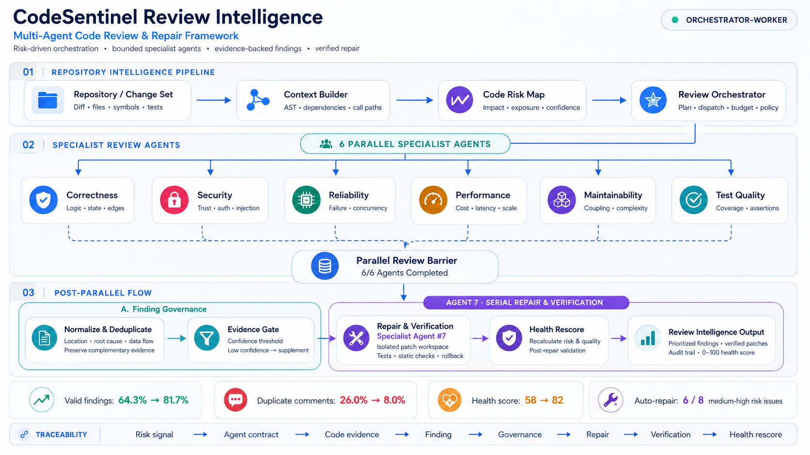

# CodeSentinel Multi-Agent Review

> Orchestrated multi-agent code review, evidence verification, and automated repair.

**面向 AI IDE 与工程交付场景的多 Agent 代码审查与自动修复框架**

[](#release-status)
[](#architecture)
[](#runtime-environment)
[](#deployment-blueprint)
[](#review-output)

CodeSentinel coordinates six parallel review specialists and one serial repair agent through explicit contracts and structured handoffs. The pipeline builds a repository risk map, collects evidence-linked findings, waits at a parallel review barrier, performs governance and deduplication, then enters isolated repair, verification, and health rescoring.

> This repository currently contains the architecture, configuration contracts, deployment blueprint, and evaluation summary. The implementation source and runtime image are not yet public. Commands that require the implementation are marked accordingly.

## Architecture



### Execution model

```text
Repository intelligence
        ↓
6 parallel specialist agents
        ↓
Parallel barrier: 6/6 completed
        ↓
Finding governance and evidence gate
        ↓
Agent 7: serial repair and verification
        ↓
Health rescore and review output
```

| Stage | Responsibility |
|---|---|
| Repository intelligence | Diff scope, AST context, dependency paths, code risk map |
| Six parallel agents | Correctness, security, reliability, performance, maintainability, test quality |
| Parallel barrier | Wait for all specialists and validate their structured handoffs |
| Finding governance | Normalize, deduplicate, supplement evidence, rank severity |
| Serial repair agent | Generate isolated patches and execute verification gates |
| Output | Findings, verified patches, audit trail, and 0–100 health rescore |

## Repository Layout

```text
code-sentinel-multi-agent-review/
├── assets/
│   └── architecture.png
├── config/
│   ├── agents.example.yaml
│   ├── review-policy.example.yaml
│   ├── runtime.example.yaml
│   └── scoring.example.yaml
├── deploy/
│   └── docker-compose.example.yml
├── docs/
│   ├── DEPLOYMENT.md
│   └── PROJECT_PROFILE.md
├── .env.example
├── .gitignore
├── README.md
└── SECURITY.md
```

Application packages, Dockerfile, schemas, tests, and CLI entry points will be added with the implementation release.

## Runtime Environment

### Reference requirements

| Component | Reference version | Purpose |
|---|---:|---|
| Python | 3.11+ | Orchestration and agent runtime |
| Docker Engine | 25+ | Isolated services and repair sandbox |
| Docker Compose | 2.24+ | Local service topology |
| PostgreSQL | 16 | Review jobs, findings, lineage, audit events |
| Redis | 7 | Worker queue, locks, and transient coordination |
| Git | 2.40+ | Repository ingestion and patch worktrees |

Recommended development host: 8 CPU cores, 16 GB RAM, and 20 GB free disk. Model execution may be remote; local-model requirements depend on the selected provider.

### Environment variables

Copy the template after the implementation is released:

```bash
cp .env.example .env
```

Core groups:

| Prefix | Examples | Scope |
|---|---|---|
| `CODESENTINEL_` | environment, log level, workspace root | Runtime behavior |
| `DATABASE_` | URL, pool size | PostgreSQL persistence |
| `REDIS_` | URL, queue name | Worker coordination |
| `MODEL_` | provider, model, API base, token budget | LLM gateway |
| `REVIEW_` | parallelism, timeout, confidence threshold | Review execution |
| `REPAIR_` | enabled, sandbox, validation timeout | Patch lifecycle |
| `OBSERVABILITY_` | traces, metrics, retention | Operational telemetry |

Secrets must be supplied by the deployment environment. Do not commit `.env`, model API keys, repository tokens, or private source snapshots.

## Configuration

CodeSentinel separates runtime configuration from review policy.

| File | Responsibility |
|---|---|
| [`config/runtime.example.yaml`](config/runtime.example.yaml) | Queue, persistence, workspaces, timeouts, observability |
| [`config/agents.example.yaml`](config/agents.example.yaml) | Specialist contracts, parallel groups, serial repair stage |
| [`config/review-policy.example.yaml`](config/review-policy.example.yaml) | Severity rules, evidence gates, deduplication, repair eligibility |
| [`config/scoring.example.yaml`](config/scoring.example.yaml) | Code-health weights and score boundaries |
| [`.env.example`](.env.example) | Environment-specific endpoints and secrets interface |

Configuration is loaded in the following order, with later sources taking precedence:

```text
Built-in defaults → YAML files → .env → process environment → CLI overrides
```

### Concurrency contract

```yaml
execution:
  parallel_review:
    agents: 6
    fail_fast: false
    barrier: all_completed
  serial_repair:
    enabled: true
    starts_after: finding_governance
    max_concurrency: 1
```

The barrier prevents the repair agent from acting on an incomplete parallel review.

## Deployment Blueprint

The Compose file describes the intended service topology:

```text
API / CLI
   │
   ├── Orchestrator
   ├── Review workers × 6
   ├── Repair worker × 1
   ├── PostgreSQL
   └── Redis
```

Validate the deployment configuration:

```bash
docker compose -f deploy/docker-compose.example.yml config
```

The application services reference a future CodeSentinel runtime image and will not start until that image or local implementation is available. Infrastructure-only startup and production guidance are documented in [`docs/DEPLOYMENT.md`](docs/DEPLOYMENT.md).

### Intended startup sequence

```bash
# 1. Create local environment file
cp .env.example .env

# 2. Validate resolved Compose configuration
docker compose -f deploy/docker-compose.example.yml config

# 3. Start dependencies
docker compose -f deploy/docker-compose.example.yml up -d postgres redis

# 4. Implementation release only: start application services
docker compose -f deploy/docker-compose.example.yml --profile app up -d
```

### Health and readiness

The runtime contract reserves the following endpoints:

```text
GET /health/live   process is running
GET /health/ready  database, Redis, model gateway, and workers are ready
GET /metrics       operational metrics when enabled
```

## Review Invocation

Planned CLI interface:

```bash
codesentinel review \
  --repository /workspace/project \
  --base-ref main \
  --head-ref HEAD \
  --policy config/review-policy.example.yaml \
  --output artifacts/review.json
```

Planned operating modes:

| Mode | Behavior |
|---|---|
| `review-only` | Produce findings without changing the worktree |
| `suggest-repair` | Generate patch proposals without applying them |
| `verified-repair` | Apply patches in isolation and run configured validation |
| `ci-gate` | Return a non-zero status when policy thresholds are exceeded |

## Review Output

All agents hand off findings through a versioned JSON contract:

```json
{
  "finding_id": "SEC-001",
  "agent": "security",
  "severity": "high",
  "confidence": 0.91,
  "location": {
    "file": "src/example.py",
    "start_line": 42,
    "end_line": 48
  },
  "evidence": "Untrusted input reaches a query builder.",
  "recommended_action": "Use parameterized query construction.",
  "verification": {
    "status": "pending",
    "checks": []
  }
}
```

Artifacts are intended to be written under `artifacts/<review-id>/`:

```text
findings.json       normalized findings
review-report.md    human-readable report
patch.diff          proposed or verified patch
verification.json  test and static-check results
trace.jsonl         agent and evidence lineage
```

## Preliminary Evaluation

These prototype figures are not yet independently reproducible; the dataset and measurement scripts will be published with the implementation.

| Metric | Baseline | Multi-agent pipeline |
|---|---:|---:|
| First-pass valid finding rate | 64.3% | 81.7% |
| Duplicate comment rate | 26.0% | 8.0% |
| Medium/high-risk findings repaired | — | 6 of 8 |
| Code health score after repair | 58 | 82 |

Results may vary by repository, language, model provider, and review policy.

## Operational Safety

- Review untrusted repositories in isolated workspaces.
- Run repair commands without host credentials or unrestricted network access.
- Require explicit validation before accepting generated patches.
- Redact source content from logs and model traces where required.
- Apply CPU, memory, wall-time, token, and output-size limits per job.
- Preserve finding, patch, and verification lineage for auditability.

See [`SECURITY.md`](SECURITY.md) and [`docs/DEPLOYMENT.md`](docs/DEPLOYMENT.md).

## Release Status

Available now:

- architecture and execution model;
- environment and configuration contracts;
- deployment topology;
- preliminary evaluation summary.

Not yet public:

- orchestration implementation;
- runtime container image;
- CLI and API server;
- schemas, tests, and reproducible benchmark assets.

No production-readiness claim is made at this stage.

## License

The license will be selected before implementation source code is released.

