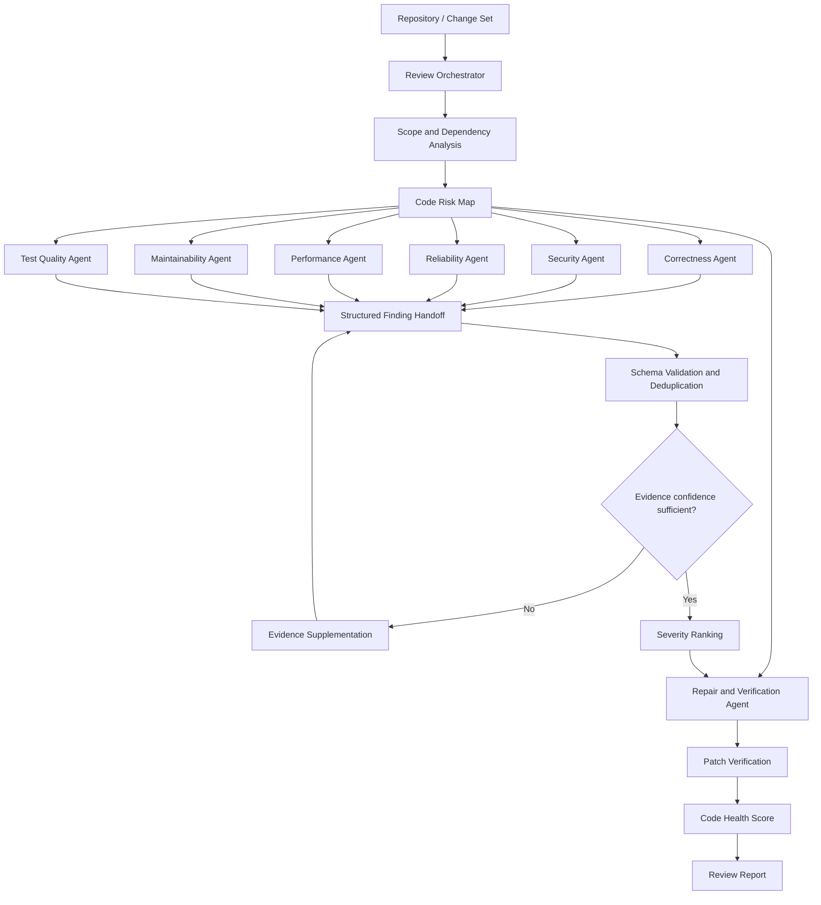

# CodeSentinel Multi-Agent Review

> An orchestrated multi-agent framework for risk-aware code review, evidence verification, and automated repair.

**面向 AI IDE 场景的多 Agent 代码审查与自动修复框架**

[](#project-status)
[](#system-architecture)
[](#specialist-agent-system)
[](#structured-handoff-protocol)
[](#license)

**CodeSentinel Multi-Agent Review** explores how multiple specialized AI agents can collaborate on code review without producing fragmented, duplicated, or weakly supported findings.

The framework is designed for AI-assisted development environments where a single-agent reviewer may suffer from unstable coverage, mixed issue classification, insufficient evidence, and inconsistent repair quality. CodeSentinel decomposes the review process into bounded specialist roles, coordinates them through an Orchestrator–Worker workflow, and closes the loop with evidence supplementation, verification, repair, and rescoring.

> **Important:** This repository currently publishes the project architecture, evaluation summary, and roadmap only. Implementation source code and reproducible evaluation assets have not yet been released.

## The Problem

AI code review is not simply a matter of asking a model to “find bugs.” A useful review system must answer several harder questions:

- Which files and execution paths carry the highest risk?
- Which specialist should inspect each risk category?
- Does every finding have sufficient code-level evidence?
- Are multiple agents reporting the same underlying defect?
- Can a proposed repair be verified instead of accepted at face value?
- Did the codebase actually become healthier after the repair?

CodeSentinel models review as a **risk-driven, evidence-backed collaboration protocol** rather than an unconstrained multi-agent conversation.

## System Architecture



## Core Design

### Specialist Agent System

The planned review topology contains seven bounded specialist roles. Each agent receives an explicit review contract defining its responsibility, evidence requirements, prohibited behavior, and output schema.

| Agent | Primary responsibility |
|---|---|
| Correctness | Logic defects, state transitions, boundary conditions |
| Security | Trust boundaries, injection paths, authentication and authorization risks |
| Reliability | Failure handling, concurrency, resource lifecycle, resilience |
| Performance | Expensive paths, redundant work, scalability risks |
| Maintainability | Complexity, coupling, clarity, change risk |
| Test Quality | Missing coverage, weak assertions, regression exposure |
| Repair & Verification | Patch generation, validation, regression checks, rescoring |

These roles describe the target architecture. Their exact prompts, tools, and execution policies may evolve during implementation.

### Prompt Contracts

Agent collaboration is constrained by explicit prompt contracts rather than relying on role names alone. A contract is expected to define:

```yaml
agent_contract:
  role: security_reviewer
  scope:
    - trust_boundaries
    - injection_risks
    - access_control
  required_evidence:
    - file_path
    - line_range
    - vulnerable_flow
  must_not:
    - report_style_only_issues
    - emit_findings_without_evidence
  output_schema: finding.v1
```

This boundary design is intended to reduce category overlap and stabilize review coverage.

### Code Risk Map

Before specialist dispatch, the orchestrator builds a risk map from the change set and surrounding repository context. Candidate signals include:

- dependency centrality and call-path reachability;
- authentication, persistence, parsing, and external-input boundaries;
- change size and historical hotspot indicators;
- test proximity and coverage gaps;
- confidence of the initial static and semantic analysis.

High-risk areas receive priority review. Findings with low confidence enter an evidence-supplementation path before final adjudication.

### Structured Handoff Protocol

All findings use a shared JSON contract so they can be validated, merged, ranked, and audited consistently.

```json
{
  "finding_id": "SEC-001",
  "category": "security",
  "severity": "high",
  "confidence": 0.91,
  "location": {
    "file": "src/example.py",
    "start_line": 42,
    "end_line": 48
  },
  "evidence": "Untrusted input reaches the query builder without parameterization.",
  "impact": "An attacker may alter the generated query.",
  "recommended_action": "Use parameterized query construction.",
  "verification": []
}
```

The final schema will be versioned when the implementation is released.

### Hierarchical Deduplication

Duplicate findings are not removed through text similarity alone. The planned merge strategy evaluates findings by:

1. affected symbol and code location;
2. underlying failure mechanism;
3. execution or data-flow evidence;
4. impact and remediation equivalence.

This preserves complementary evidence while collapsing repeated commentary about the same defect.

### Review, Repair, and Rescore

The target workflow closes the loop:

```text
Initial review → Evidence verification → Severity ranking → Repair → Regression verification → Health rescore
```

A 0–100 code health model aggregates review outcomes by severity, confidence, affected surface, and verification status. It is intended as a comparative engineering signal—not a universal measure of software quality.

## Preliminary Evaluation

The following figures come from the project's current prototype test notes. They are included as preliminary results and should not be treated as independently reproducible benchmarks until the evaluation dataset, baselines, and measurement scripts are published.

| Metric | Baseline | Multi-agent pipeline | Observed change |
|---|---:|---:|---:|
| First-pass valid issue hit rate | 64.3% | 81.7% | +17.4 percentage points |
| False-positive rate | Baseline | — | 20% relative reduction |
| Duplicate comment rate | 26.0% | 8.0% | −18.0 percentage points |
| Medium/high-risk issues identified | — | 8 | Prototype test set |
| Issues automatically repaired | — | 6 of 8 | Prototype test set |
| Code health score | 58 | 82 | +24 points after repair |

### Evaluation disclosure

- Dataset composition and sample size are not yet published.
- Results may not generalize to other languages, repositories, or model providers.
- “Automatically repaired” requires compilation, tests, or scenario-specific verification before production use.
- Future releases should include ablation studies comparing single-agent and multi-agent configurations under equal model and token budgets.

## Engineering Principles

### Evidence Before Verdict

Every actionable finding should point to a concrete location, explain the failure mechanism, and state its expected impact.

### Bounded Collaboration

Specialization is valuable only when agent responsibilities, tools, and outputs are constrained. More agents do not automatically produce a better review.

### Verification Before Merge

Generated patches are proposals until validated by tests, static checks, build results, or explicit behavioral evidence.

### Quality and Cost Must Be Measured Together

Review quality, latency, token usage, duplicate rate, and verification success should be evaluated as one system—not optimized in isolation.

## Project Status

This repository is currently an **architecture preview**.

- [x] Multi-agent responsibility model
- [x] Orchestrator–Worker review workflow
- [x] Risk-map and evidence-supplementation design
- [x] Structured handoff and deduplication design
- [x] Preliminary prototype evaluation summary
- [ ] Public finding schema
- [ ] Runnable review orchestrator
- [ ] Repository adapters and context builder
- [ ] Repair sandbox and verification runners
- [ ] Reproducible evaluation dataset
- [ ] Benchmark methodology and ablation report
- [ ] IDE and pull-request integrations

No production-readiness claim is made at this stage.

## Planned Technology Strategy

| Layer | Candidate approach |
|---|---|
| Orchestration | Python, asynchronous task graph, bounded worker execution |
| Agent contracts | Versioned prompts, typed inputs, structured outputs |
| Repository intelligence | AST, dependency graph, semantic code retrieval |
| Validation | JSON Schema, static analysis, build and test runners |
| Repair | Isolated patch workspace, diff validation, rollback |
| Observability | Agent traces, finding lineage, cost and latency telemetry |
| Integration | AI IDE, CLI, GitHub pull-request review |

Technology choices remain provisional until the source release.

## Roadmap

### Phase 1 — Review Protocol

- publish the finding schema and agent contracts;
- implement repository scope analysis and risk mapping;
- produce structured, evidence-linked review reports.

### Phase 2 — Verification and Repair

- add isolated patch generation and validation;
- integrate tests, linters, and static analyzers;
- implement post-repair health rescoring.

### Phase 3 — Evaluation and Integration

- publish reproducible benchmarks and ablations;
- add IDE and pull-request workflows;
- introduce policy packs for different engineering domains.

## Responsible Use

AI-generated code findings and repairs must be reviewed before production use. CodeSentinel is intended as engineering decision support and does not guarantee vulnerability detection, correctness, or regulatory compliance.

## License

The license has not yet been selected. A license will be added before implementation source code is released.

## Vision

Build a review intelligence layer in which specialized agents collaborate through explicit contracts, every finding carries verifiable evidence, and every repair is measured against the risks it was intended to remove.

